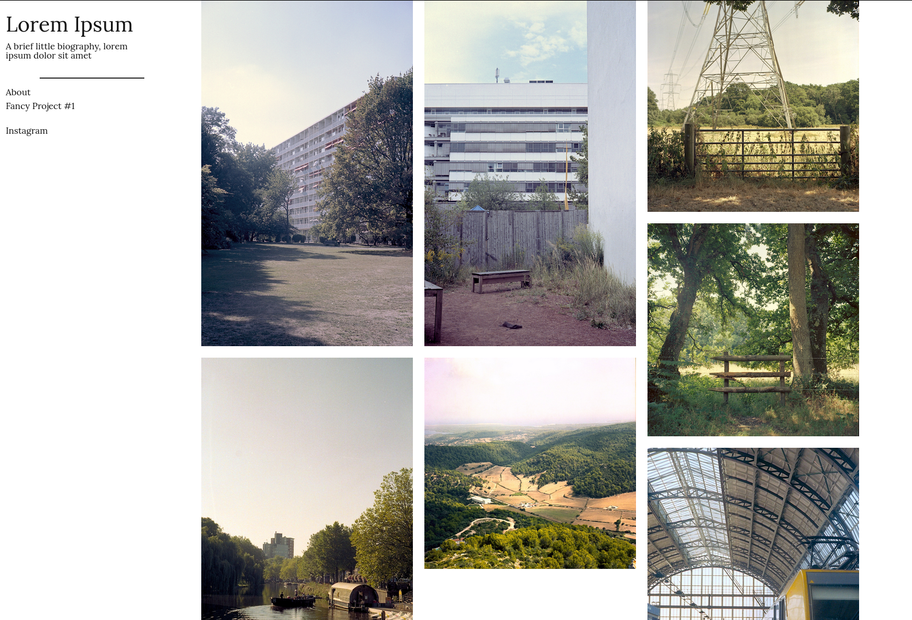
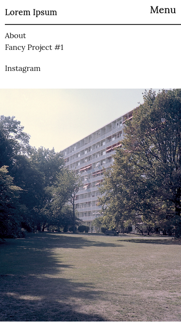

# Photo Theme
**A simple, responsive photo grid theme for Hugo**

### Screenshots



### Installation
Firstly you need to clone this repo in the `themes` directory for your project:
```
$ cd themes
$ git clone https://github.com/TomJamesGray/hugo-photo-theme
```
Then specify `hugo-photo-theme` as your theme by adding the following line in your `config.toml` file
```
theme = "hugo-photo-theme"
```

### Grid usage
To add photos to the grid all you need to do is make a post as usual then specify the image url as the `imgPostUrl property`, for example

```
---
title: "Image Name"
date: 2020-04-02T21:44:26+01:00
draft: false
imgPostUrl: "Your URL Here"
---
```

### Options
Short bio (the text under the site title)
```
[params]
    shortBio = "xyz"
```